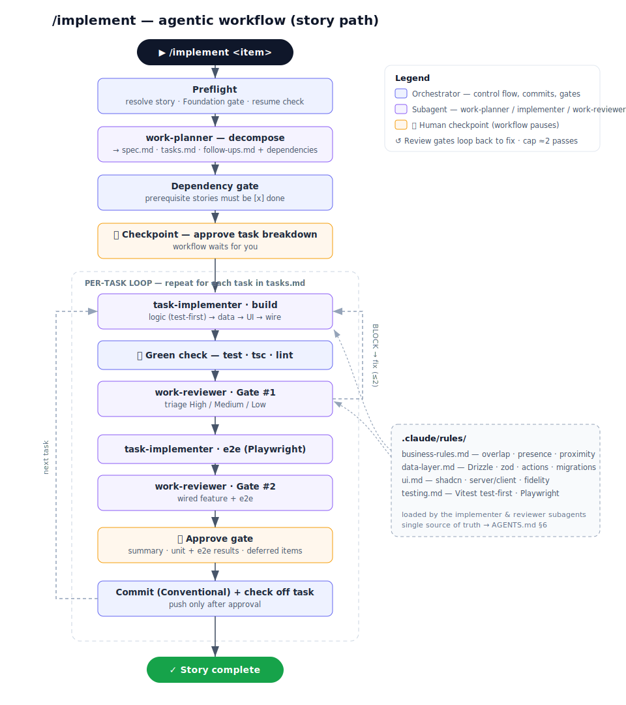

# Agentic Workflow

This repo is built by an agentic workflow that shares one shape — delegate the thinking to subagents, gate at human checkpoints, and commit only when green. **`/backlog`** authors work items into `docs/backlog.md`; **`/implement`** executes them.

The core is **`/implement`** — a single trigger, `/implement <item>`, that takes **one backlog item to a committed, green change**. It **classifies the item's type** — `story` · `bug` · `chore` — then runs one shared **decompose → build → review → approve → commit** loop with per-type adjustments: a **diagnosis pre-phase** for bugs (prove the root cause before touching code) and **design refs + Playwright e2e** for stories. Orthogonally, each **task** runs in an **app** or **infra** build lane (infra = Docker/Terraform/CI/shell → `devops-implementer`) — so an infra change is a chore (or a bug) with `lane: infra` tasks, **not a fourth type**. Its orchestration splits across a **skill** (the playbook), five **subagents** (planner / implementer / devops-implementer / diagnoser / reviewer), and five **rule files** (domain gates), so each concern is isolated but driven from one command.

`/feature`, `/fix`, and `/chore` are **thin aliases** that preset the classification — one per item type (`/feature`→story, `/fix`→bug, `/chore`→chore) — handy when you already know what the item is. They add no behavior of their own; the loop lives once in `/implement`. (There's no `/devops` command — an infra change is a chore or bug whose tasks are tagged `lane: infra`; see the two axes below.) **`/backlog`** authors the items the loop consumes (see [Authoring items](#authoring-items--the-backlog-skill)).



---

## TL;DR — how to use it

```text
# Restart the session once after the workflow files are added (agents load at session start)

/implement foundation        # build the frozen shared base first — every story depends on it
/implement office-map        # then any item, one at a time — type is auto-detected
/implement reservation       # reserve-a-desk …
/fix "cancel 500s on past dates"   # alias: straight to bug mode (diagnosis first)
/chore "pin the setup-terraform version"   # alias: chore mode (its infra tasks run the infra lane)
```

You can pass a **slug**, the **item text**, or a **raw backlog line** — all resolve to the same `docs/backlog.md` item. The workflow pauses at 🛑 checkpoints and waits for your plain-English reply (`go`, or `merge tasks 1 & 2`, etc.).

---

## The pieces

| File                                                      | Role                                                                                                                                                                                                                                                           |
| --------------------------------------------------------- | -------------------------------------------------------------------------------------------------------------------------------------------------------------------------------------------------------------------------------------------------------------- |
| `.claude/skills/backlog/SKILL.md`                         | **Backlog author** (`/backlog`). Turns a description into one well-formed **story / bug / chore** item in `docs/backlog.md`. Authoring only — no decomposition or diagnosis. See _Authoring items_ below.                                                      |
| `.claude/skills/implement/SKILL.md`                       | **Orchestrator** (`/implement`). Classifies the item's type, then owns control flow, the human checkpoints, commits, and `tasks.md` bookkeeping across the shared loop. Delegates the thinking-heavy work so its context stays lean.                           |
| `.claude/skills/{feature,fix,chore}/SKILL.md`             | **Thin aliases** of `/implement`, one per item type: `feature`→story, `fix`→bug, `chore`→chore. No loop logic of their own — they point at the core skill.                                                                                                     |
| `.claude/agents/work-planner.md`                          | **Decomposes** one item → `spec.md`, `tasks.md`, `follow-ups.md`, design copies (story/UI bug), and a dependency list. Tailors the plan to the item's type; tags each task `lane: app`\|`infra`. Plans only — never implements.                                |
| `.claude/agents/task-implementer.md`                      | **Builds** one **`lane: app`** task across layers (logic test-first → data → UI → wire → green), applies review fixes, or writes the e2e spec.                                                                                                                 |
| `.claude/agents/devops-implementer.md`                    | **Builds** one **`lane: infra`** task (Docker · Terraform · CI · shell) and self-verifies with available tooling. Never runs `terraform apply`; never commits.                                                                                                 |
| `.claude/agents/bug-diagnoser.md`                         | **Diagnoses** one bug (the pre-phase for bug items): reproduces it, confirms the root cause (`file:line` + mechanism), proposes a root-cause fix + blast radius + regression-test plan. Read-only — never edits code.                                          |
| `.claude/agents/work-reviewer.md`                         | **Reviews** the working-tree diff adversarially; returns severity-triaged findings + a verdict. Read-only — it reports, it never fixes. Applies the right **lens**: default / bug-fix / chore by item type, plus the **infra** lens on any `lane: infra` task. |
| `.claude/rules/{business-rules,data-layer,ui,testing}.md` | **Domain gates** the implementer and reviewer load. Thin checklists that point back to `AGENTS.md` as the single source of truth.                                                                                                                              |
| `.claude/rules/infra.md`                                  | **Infra/deploy gate** (Docker · Terraform · CI/CD). Path-scoped — auto-loads in **any** session touching infra files. Read by `work-reviewer` and `devops-implementer` for infra diffs; the app `task-implementer` does not load it. Defers to `AGENTS.md`.    |
| `.claude/skills/implement/templates/`                     | `spec.md` / `tasks.md` / `follow-ups.md` / `metrics.md` scaffolds filled per item.                                                                                                                                                                             |

Each item's working files live in its type's work folder — `features/` · `fixes/` · `chores/<slug>/` — created by the planner, not committed until you approve.

### Model strategy

Every subagent runs on **Opus** — reasoning quality is the priority across planning, implementation, and review, and the human gates + green checks bound how much any single step can cost. The choice is uniform so there's no per-role tier to keep in sync.

| Component                   | Model               | Rationale                                                                                                 |
| --------------------------- | ------------------- | --------------------------------------------------------------------------------------------------------- |
| Orchestrator (your session) | **Opus** (`/model`) | Coordination + triage across a long-lived context; runs on whatever your session model is.                |
| `work-planner`              | **Opus** (pinned)   | One-shot, human-gated decomposition. A bad spec/task split poisons every downstream turn — high leverage. |
| `task-implementer`          | **Opus** (pinned)   | Bulk of the app work; strongest coder; protected by green check + 2 review gates + approval.              |
| `devops-implementer`        | **Opus** (pinned)   | Infra edits + self-verify for the infra build lane; same tier as `task-implementer`.                      |
| `bug-diagnoser`             | **Opus** (pinned)   | Root-cause investigation — diagnosis quality is the whole game for a bug.                                 |
| `work-reviewer`             | **Opus** (pinned)   | Adversarial review gates — highest-value place for strong reasoning.                                      |

Pinned in each agent's frontmatter (`model:`), so the choice holds regardless of which model your session runs on. **Override:** for a trivial single-line `fix` pass you may drop that one call to `haiku` to save tokens; note any override to the human.

---

## The two axes

Two orthogonal dimensions decide how an item is executed — don't conflate them:

- **Item type** (`story` · `bug` · `chore`) — _what kind of work_. Toggles the **workflow shape** below.
- **Task lane** (`app` · `infra`) — _which layer a task touches_. The planner tags each task `lane:`; it picks the **build lane**. Infra is a lane, **not** a type — a standalone infra change is a `chore` (or a `bug`, if it's a defect) whose tasks are `lane: infra`.

**Item-type profile** — the item type toggles which phases run; everything else (build → green → review → 🛑 approve → commit) is shared:

| Phase                        | **story**                 | **bug**                 | **chore**          |
| ---------------------------- | ------------------------- | ----------------------- | ------------------ |
| Foundation gate              | ✅                        | —                       | —                  |
| **Diagnose** (🛑 root cause) | —                         | **✅ (pre-phase)**      | —                  |
| Work folder                  | `features/<slug>/`        | `fixes/<slug>/`         | `chores/<slug>/`   |
| Decompose shape              | vertical slices + design  | fix-shaped (test-first) | technical seams    |
| Dependency gate              | ✅                        | rare                    | rare               |
| Design refs                  | ✅                        | UI bugs only            | —                  |
| Review lens (app side)       | default (design/UI/rules) | bug-fix                 | chore              |
| Migration rollup             | if schema changed         | if schema changed       | if schema changed  |
| Commit type                  | `feat(<slug>)`            | `fix(<scope>)`          | `chore`/`refactor` |

**Task-lane profile** — set per task, orthogonal to the above:

| Aspect      | **`lane: app`** (default)        | **`lane: infra`**                              |
| ----------- | -------------------------------- | ---------------------------------------------- |
| Build via   | `task-implementer`               | `devops-implementer` (never `terraform apply`) |
| e2e         | per-task `e2e:` field            | **skip** (no Playwright flow)                  |
| Review lens | app-side (by item type)          | **infra** (`work-reviewer` loads `infra.md`)   |
| Commit type | item type (`feat`/`fix`/`chore`) | `ci` / `build` / `chore(infra)`                |

---

## How it works

### Preflight — classify & resolve (before anything)

1. **Resolve the item and its type.** Match the argument to a `docs/backlog.md` line (by slug, text, or line) or take the free-form text, then determine `story` | `bug` | `chore`. When the argument resolves to a **backlog line, its section is authoritative** — `## Bugs`→bug, `## Chores`→chore, a feature `##` group→story — so a filed item is never re-guessed. Otherwise it comes from the invoking alias (`/feature`→story, `/fix`→bug, `/chore`→chore), a `bug:`/`chore:` prefix, or inference from free-form text. A Docker/Terraform/CI/shell change isn't a separate type — it's a `chore` (or `bug`) the planner will tag `lane: infra`. Ambiguous → it confirms the type with you.
2. **Foundation gate — story only.** If the item is a `story` and backlog item `0. Foundation` is not `[x]`, the workflow **refuses to run** (unless the story _is_ Foundation). Bug/chore items skip this gate.
3. **Resume check** — if the type's work folder `<root>/<slug>/` already exists, it resumes at the first unchecked task instead of re-planning.

### Phase D — Diagnose (bug items only)

The defining work of a bug fix is **proving the root cause before touching code**, so it happens before planning:

- The read-only **`bug-diagnoser`** reproduces the bug and **confirms the root cause** (`file:line` + mechanism), then proposes a root-cause fix + blast radius + regression-test plan.
- 🛑 **Checkpoint — root cause & plan.** You confirm the root cause before any planning or code — this gate is the whole point: it stops symptom-patching. If the real fix turns out **feature-sized**, the item is **re-classified** as a `story` rather than band-aided. An **infra bug** (broken workflow/Dockerfile/deploy) stays a bug — it gets this gate, and its fix tasks are tagged `lane: infra`. The confirmed diagnosis is handed to the planner.

_(Story / chore items skip this phase.)_

### Phase 0 — Decompose (once per item)

- Delegates to **`work-planner`**, which reads the repo as ground truth (not the hand-off summary), scaffolds the type's work folder, fills the spec (acceptance criteria for a story; the confirmed root cause + fix plan for a bug; the goal for a chore), and breaks the item into **small tasks** (usually 3–6 for a story; fewer for bugs/chores), tagging each `lane: app` or `lane: infra`.
- **Dependency gate — story only.** Any prerequisite _story_ the planner flags (e.g. `reservation` needs `office-map`) must be `[x]` done in the backlog **and** exist in code. If not, the workflow stops and recommends running the prerequisite first.
- 🛑 **Checkpoint — task breakdown.** You see the type, slug, the proposed `tasks.md`, dependency status, and risks. The loop won't start until you confirm or adjust.

### Per-task loop (repeat for each task, top to bottom)

Each task carries a **`lane:` field** (`app` default | `infra`) set by the planner — that field, not the item's type, picks the build lane. For each task the orchestrator runs this cycle, delegating each step to a fresh subagent so its own context stays small:

1. **Build** —
   - **`lane: app`** → `task-implementer` (mode `build`): refine the task spec, write domain logic **test-first**, add the data layer (zod + typed Drizzle + business-rule guard; schema via `db:push` during dev — migrations roll up **once at the end**, AGENTS.md §5), build UI (shadcn, server/client boundary), wire it up.
   - **`lane: infra`** → `devops-implementer` (mode `build`): make the infra edit and **self-verify** with available tooling. Never runs `terraform apply`.
2. **Green check** — app: `pnpm test`, `tsc --noEmit`, `lint` all pass (`format:check` is omitted — the pre-commit hook runs `prettier --write`). Infra: the self-verify checks pass (a check skipped for a missing tool is fine; a failure is not).
3. **Review Gate #1** — `work-reviewer` applies the lens (the item type's app-side lens, or the infra lens for a `lane: infra` task) and triages findings. High + blocking-Medium are fixed (implementer mode `fix`) and re-reviewed, **capped at ~2 passes**; deferrable findings go to `follow-ups.md`; a surviving High **escalates to you**.
4. **E2E** — `task-implementer` (mode `e2e`) writes/extends a Playwright spec for the flow and runs it green. _Skipped for any task whose `e2e:` field is `skip` — all `lane: infra` tasks, plus schema-only/shared-infra app tasks; the deferral is noted in `follow-ups.md` and covered by the task that first wires the flow._
5. **Review Gate #2** — `work-reviewer` on the wired feature + e2e, same triage/exit rules. _(Skipped when step 4 was skipped.)_
6. 🛑 **Approve gate.** You get a summary (what changed, unit + e2e results, any destructive/externally-facing infra aspect, deferred items) and approve before any commit.
7. **Commit** — one Conventional Commit (type per the profile table), repo green; task checked off in `tasks.md`. **Push only after your approval.**
8. **Record metrics** — the orchestrator appends one row to `<root>/<slug>/metrics.md`: implement loops (build + fix passes), review loops (gate #1 + gate #2 passes), and tokens for the task. Bookkeeping it already has from the loop — no extra model call. _(Optional for a one-off bug/chore.)_

### End of item — the scorecard

When all tasks are `[x]`, after the migration rollup (only if the item changed `db/schema.ts`) the orchestrator renders the **scorecard** from `<root>/<slug>/metrics.md`: a table of every completed task with its **implement loops**, **review loops**, and **tokens per task** (plus a totals row), then marks the item `[x]` in `docs/backlog.md`.

This is deliberately the **cheapest possible** reporting: the orchestrator renders a ledger it filled in as it went — **no reporter subagent, no extra model invocation, zero added tokens.** Token counts are best-effort from each subagent's completion report (`n/a` when a count isn't surfaced). Because the data lives in `metrics.md`, the table can be re-rendered on demand.

---

## Authoring items — the `/backlog` skill

Every execution run consumes an item from `docs/backlog.md`; **`/backlog <description>`** is the front door that authors one. It detects whether the description is a **story**, a **bug**, or a **chore/enabler**, writes it in the exact backlog format, and (with your confirmation) inserts it under the right section:

| Item type           | Backlog shape                              | Executed by                  |
| ------------------- | ------------------------------------------ | ---------------------------- |
| **Story**           | `As a <role> I can … so …`                 | `/implement` (or `/feature`) |
| **Bug**             | `Bug: <symptom>` + expected/observed/repro | `/implement` (or `/fix`)     |
| **Chore / enabler** | `Chore: <goal>`                            | `/implement` (or `/chore`)   |

It authors the **input**, never the execution: no acceptance criteria or task breakdown, no root-cause diagnosis (those are produced at execution time). **A task is not a story** — the per-task breakdown lives in the work folder's `tasks.md`, produced by the planner at execution time and never in the backlog; a "chore" is a standalone work item, not a story's sub-step.

## Why it's shaped this way

- **One trigger, separated concerns.** Control flow lives only in the skill; domain knowledge lives only in the rules; review can't grade its own work because the reviewer is a read-only subagent and fixes route back to the implementer.
- **One loop, per-type profiles — not separate skills.** Merging story/bug/chore into one core loop kills drift (there's a single build→review→approve→commit definition), while the profile table keeps each type's real differences — the bug diagnosis gate, story design refs — intact. The `/feature` `/fix` `/chore` aliases are ~20-line files that only preset the classification (one per item type).
- **Type and lane are orthogonal.** _What kind of work_ (story/bug/chore) is separate from _which layer a task touches_ (app/infra). That's why an infra change isn't a fourth type — a broken deploy is a **bug** (it gets diagnosed) whose fix runs in the infra lane; "pin the terraform version" is a **chore** in the infra lane. Lane is a per-task tag, so one story can mix app and infra tasks without a special case.
- **The diagnosis gate survives.** A bug never gets planned before its root cause is confirmed — the pre-phase + 🛑 checkpoint is preserved exactly, because forcing a bug through "decompose first" is how you end up patching symptoms.
- **Ceremony scales down.** A one-line fix can be a 1-task plan with no design copy and no scorecard; a story can be a 6-task vertical-slice build. Same loop, right-sized.
- **Subagent-per-task** keeps the orchestrator's context lean across a long item, so it doesn't get summarized mid-build.
- **Two human gates** (breakdown + per-task approve; three for a bug, with the root-cause gate) keep you the merge authority.
- **Repo is ground truth.** The planner verifies files/schema/routes itself; checkboxes and hand-off summaries can be stale.
- **Safety line for infra:** the devops lane plans/validates but never applies. `terraform apply` happens only in the human-gated deploy pipeline (`.github/workflows/deploy.yml`) — so the approve gate **explicitly flags any destructive or externally-facing change** (instance replacement, opened ports, secret handling) for a deliberate human decision before it can ship.
- **DRY rules.** The rule files are gate checklists that defer to `AGENTS.md §6` — if they ever drift, §6 wins.

---

## Using it — details

### Trigger forms

```text
/implement reservation
/implement As an employee I can reserve an available desk for a date and time range so I have a guaranteed seat.
/implement - [ ] As an employee I can view the office map for a selected date and time window...
/fix "the cancel button 500s for reservations on past dates"     # alias → bug
/chore "pin the setup-terraform action version"                  # alias → chore (infra-lane tasks)
```

### First-time setup (important)

Project subagents in `.claude/agents/` are loaded **at session start**. If the workflow files were just added or renamed, **restart the session or `/clear` once** before the first `/implement` run, or the delegated `Agent` calls fail with _"agent type not found."_

### Order of stories

The backlog is ordered by dependency. In practice:
`foundation` → `office-map` → `reservation` → `my-reservations` → presence/proximity stories. The Foundation gate and the per-story dependency gate enforce this for you.

### What you do at each pause

- **Root-cause gate (bugs):** confirm the diagnosed cause, or redirect the investigation.
- **Breakdown gate:** confirm or reshape the task list (`merge 1 & 2`, `split task 3`, `time granularity = 30 min`).
- **Approve gate:** approve the task's diff + tests, or send it back. Commit/push happen only after you approve.

---

## Extending the workflow

- **Tune behaviour** by editing the rule files (`.claude/rules/*.md`) — they're the gates both subagents read; changes apply everywhere without touching the agents.
- **Adjust roles** by editing the agent prompts (`.claude/agents/*.md`).
- **Change the loop** (e.g. add a security-review gate, raise the review-pass cap, add a new type profile) by editing `.claude/skills/implement/SKILL.md` — the one place the loop is defined.
- Keep `business-rules.md` aligned with `AGENTS.md §6`; §6 is authoritative.

---

## Appendix — editable diagram source (Mermaid)

The PNG/SVG above is the rendered diagram. This Mermaid block renders on GitHub and is the easy-to-edit source if you want to change the flow.

```mermaid
flowchart TD
    A([▶ /implement &lt;item&gt;]) --> B[Preflight: resolve + classify type · Foundation gate story · resume]
    B -->|bug| DX[/bug-diagnoser — reproduce + confirm cause/]
    DX --> DG[🛑 Root-cause gate]
    DG --> C
    B -->|story · chore| C[/work-planner — decompose<br/>spec · tasks + lane app/infra · deps/]
    C --> D{Dependency gate<br/>prereq stories [x]?}
    D -->|missing| STOP[/Stop — run prerequisite first/]
    D -->|ok| E[🛑 Checkpoint: approve task breakdown]
    E --> F

    subgraph LOOP [Per-task loop — repeat for each task]
        direction TB
        F{task lane?}
        F -->|app| G[/task-implementer · build<br/>logic→data→UI→wire/]
        F -->|infra| GI[/devops-implementer · build + self-verify/]
        G --> H[✅ Green check: test · tsc · lint]
        GI --> H
        H --> I[/work-reviewer · Gate #1 · typed lens/]
        I -->|BLOCK ≤2| F
        I -->|pass, e2e| J[/task-implementer · e2e/]
        I -->|pass, skip e2e| K
        J --> JR[/work-reviewer · Gate #2/]
        JR -->|BLOCK ≤2| J
        JR -->|pass| K[🛑 Approve gate]
        K --> L[Commit + check off task]
        L --> N[Record metrics row<br/>loops + tokens]
        N -->|next task| F
    end

    N -->|all tasks done| S[Scorecard<br/>render metrics.md table]
    S --> M([✓ Item complete])

    R[(.claude/rules/<br/>business · data · ui · testing · infra)] -.-> G
    R -.-> GI
    R -.-> I

    classDef orch fill:#eef2ff,stroke:#6366f1;
    classDef agent fill:#f5f3ff,stroke:#8b5cf6;
    classDef human fill:#fff7ed,stroke:#f59e0b;
    class B,H,L,N,S orch;
    class C,DX,G,GI,I,J,JR agent;
    class E,K,DG human;
```
